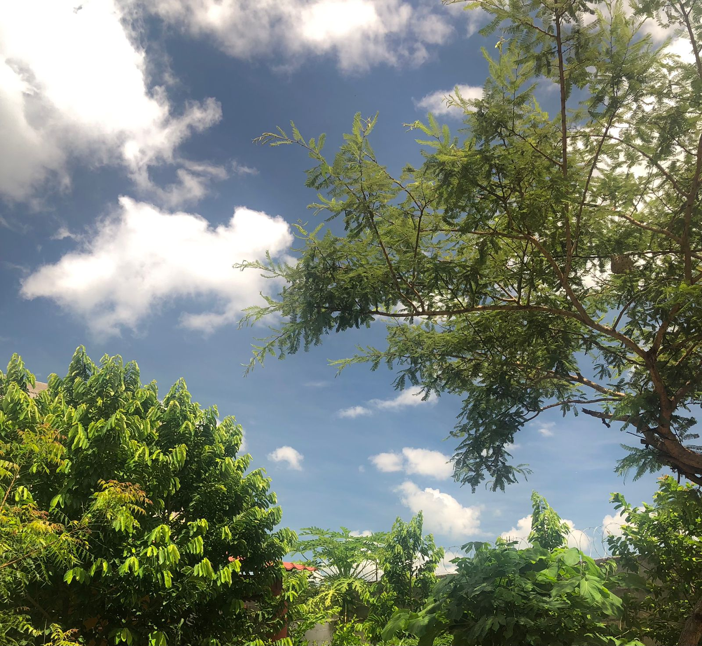

## Redes de unicel

### Unicel en la vida diaria

¿Sabías que el vaso de unicel donde tomaste tu bebida en aquella fiesta puede tardar hasta 1000 años en degradarse?

Probablemente pensarás que solo fue un vaso, pero el tema se torna más preocupante al saber que tan solo en México se desechan alrededor de 100 mil toneladas de unicel al año. 
Y es que el unicel, conocido científicamente como poliestireno expandido (EPS), es un material plástico derivado del petróleo, compuesto por un 95% de aire y 5% de materia prima, por lo que  tiende a ocupar cantidades masivas de espacio con un bajo peso neto.
Cuando el unicel es desechado, cuenta con diferentes destinos que van desde ser incinerados a grandes temperaturas emitiendo gases altamente dañinos, o bien, fragmentarse en microplásticos que pueden terminar en el océano, representando un enorme peligro para la vida marina. Además, su principal material es el estireno, un compuesto químico que ha sido catalogado como cancerígeno de acuerdo a la Agencia de Sustancias Tóxicas y el Registro de Enfermedades de Estados Unidos de América (ATSDR).

Ante esto, diferentes países han tomado cartas en el asunto a través de acciones como prohibir el uso de unicel o en la creación de plantas de separación y reciclaje. Sin embargo, separar enormes cantidades de unicel con los métodos convencionales puede representar una alternativa poco eficaz en términos económicos, generando cierto desinterés en la creación de plantas de reciclaje, tal es el caso de México, que cuenta únicamente con una planta para el reciclaje del unicel, la cual se encuentra en el centro del país y es propiedad de la compañía de plásticos Dart.

Por lo tanto, se realizó el desarrollo de una base de datos de un modelo de deep learning para el reconocimiento de unicel en desechos, con la finalidad de aportar una solución eficaz a los métodos que habitualmente se aplican en las plantas de reciclaje. 

### Metodología

Describe los pasos específicos que tomaste para realizar tu proyecto. Trata de hacer una descripción concreta y detallada. Si aplica, puedes incluir un diagrama describiendo el procedimiento. 

### Resultados

Este es el momento en que nos compartas los resultados obtenidos en tu proyecto. Asegurate de incluir material visual (gráficas, fotos, diagramas, tablas). 

Puedes inster imagenes utilizando Markdown ``.

O utilizando codigo html ``, la ventaja de utilizar html es que le puedes modificar el tamaño utilizando **width**.

### Conclusiones

La base de datos es eficaz, sin embargo, para lograr los resultados que desean obtenerse es necesario tener una mayor cantidad de datos (imágenes) y ejecutar la base de datos por un periodo de tiempo más prolongado. 

### Video
 1. Para insertar un video de YouTube, en la página de YouTube del video selecciona compartir y selecciona el código de html.
 <iframe width="560" height="315" src="https://www.youtube.com/embed/PLj1-CMNERM" title="YouTube video player" frameborder="0" allow="accelerometer; autoplay; clipboard-write; encrypted-media; gyroscope; picture-in-picture" allowfullscreen></iframe>
 
 2. Insertar el link de tu video en YouTube, [nuestro video](https://youtu.be/rmXvlBPq24Q).
 4. Puedes subir el archivo de tu video directamente a Github [instrucciones aquí](https://stackoverflow.com/questions/4279611/how-to-embed-a-video-into-github-readme-md)
 
### Equipo

* Delicia Cortés
* Andrea Tamayo
* Krystel Rodríguez
* David Ramírez

