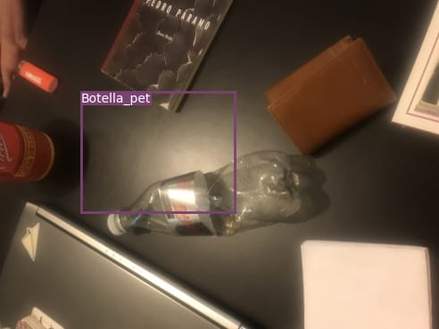

## Redes de unicel

### Unicel en la vida diaria

¿Sabías que el vaso de unicel donde tomaste tu bebida en aquella fiesta puede tardar hasta 1000 años en degradarse?

Probablemente pensarás que solo fue un vaso, pero el tema se torna más preocupante al saber que tan solo en México se desechan alrededor de 100 mil toneladas de unicel al año. 
Y es que el unicel, conocido científicamente como poliestireno expandido (EPS), es un material plástico derivado del petróleo, compuesto por un 95% de aire y 5% de materia prima, por lo que  tiende a ocupar cantidades masivas de espacio con un bajo peso neto.
Cuando el unicel es desechado, cuenta con diferentes destinos que van desde ser incinerados a grandes temperaturas emitiendo gases altamente dañinos, o bien, fragmentarse en microplásticos que pueden terminar en el océano, representando un enorme peligro para la vida marina. Además, su principal material es el estireno, un compuesto químico que ha sido catalogado como cancerígeno de acuerdo a la Agencia de Sustancias Tóxicas y el Registro de Enfermedades de Estados Unidos de América (ATSDR).

   

Ante esto, diferentes países han tomado cartas en el asunto a través de acciones como prohibir el uso de unicel o en la creación de plantas de separación y reciclaje. Sin embargo, separar enormes cantidades de unicel con los métodos convencionales puede representar una alternativa poco eficaz en términos económicos, generando cierto desinterés en la creación de plantas de reciclaje, tal es el caso de México, que cuenta únicamente con una planta para el reciclaje del unicel, la cual se encuentra en el centro del país y es propiedad de la compañía de plásticos Dart.

Por lo tanto, se llevó a cabo el desarrollo de una base de datos de un modelo de deep learning para el reconocimiento de unicel y otro tipo de polimeros de interés en desechos, con la finalidad de aportar una solución eficaz a los métodos que actualmente se aplican en las plantas de reciclaje y asi poder aportar una medida encaminada a lograr el objetivo 12: Producción y consumo sostenible, de la Agenda 2030 para el Desarrollo Sostenible de la ONU.

### Metodología

Para la detección automática de polímeros como el PET y unicel, se utilizó el sistema YOLO (por sus siglas en inglés You Only Look Once), el cual es un algoritmo con base en redes neuronales convolucionales capaz de detectar distintos objetos en tiempo real. 
Primero, se tomaron aproximadamente 200 fotos de desechos donde se visualizarán objetos de unicel y botellas pet en distintas posiciones, formas, ángulos y condiciones de iluminación. Posteriormente, utilizando el lenguaje de programación Python, se procedió a etiquetar cada una de las imágenes con el programa labelImg para asi poder llevar a cabo el entrenamiento del modelo de deep learning con duración aproximada de 5 horas para reconocer este tipo de materiales con un grado de precisión aceptable. 
Finalmente, se utilizó otro grupo reducido de imagenes de desechos para comprobar la eficiencia del modelo.

### Resultados

   

### Conclusiones

A pesar de realizar el etiquetado de residuos de PET y unicel, el entrenamiento del modelo únicamente se realizó para el reconocimiento de botellas PET debido a limitaciones de tiempo e incluso condiciones climatológicas. Sin embargo, el modelo fue capaz de detectar las botellas de PET con un grado de presición aceptable, por lo que se espera obtener resultados óptimos al entrenar el modelo para el reconocimiento de unicel. Para mejorar el entrenamiento, se sugiere aumentar significativamente el número de imágenes (>10000), asi como entrenar el modelo por un periodo de tiempo más prolongado. Además, podría ser un proyecto escalable ya que puede aplicarse para el reconocimiento de cualquier otro tipo de desecho.

### Video

 <iframe width="560" height="315" src="https://youtu.be/I2Njzl31aHA" title="YouTube video player" frameborder="0" allow="accelerometer; autoplay; clipboard-write; encrypted-media; gyroscope; picture-in-picture" allowfullscreen></iframe>
 

 
### Por equipo 2.1:

* Delicia Cortés
* Andrea Tamayo
* Krystel Rodríguez
* David Ramírez

Club 2. "Learning Machine de Polimeros"

### Bibliografía

-BASF. (2013, Mayo 23). Retrieved from http://www.basf.com.mx/Mexico/home/interior.jsp?cve_seccion=1&cve_subseccion=4&cv
-Brinkmann-Rengel. (n.d.). Synthesis of Polystyrene. Polyacrylate Block S, and N Niessner. Copolymers by.
-Chavez, H. A. (2014). Estudio de la interacción entre el proceso de etrusión y el EPS. Ciudad de México: Universidad Nacional Autonoma de México.
-Company., M. (2013, Marzo). Monsanto Company. . Retrieved from http://www.monsanto.com.mx/historia.htm 
-Ecovia, P. (n.d.). Poliestireno Expandido ‘Hielo seco. Retrieved from Poliestireno Expandido ‘Hielo seco: http://www.proyectoecovia.com/uploads/73c61c17cc20c499fec6a3e14f687fe6.pdf
-facts.org, c. s. (2021). chemical safety facts.org. Retrieved from chemical safety facts.org: https://www.chemicalsafetyfacts.org/es/poliestireno/
-FOREMEX. (n.d.). FOREMEX. Retrieved from FOREMEX: http://www.foremex.com.mx/blog/reciclaje-unicel.html
-Keenan, J. D. (2013, Junio 17). Testimony Supporting H. An Act to Restrict the Use of Polystyrene. Sierra Massachusetts Club.
-PortilloSandra, R. (2020, julio 20). Ecología verde. Retrieved from Ecología verde: https://www.ecologiaverde.com/cuanto-tarda-en-degradarse-el-unicel-2833.html
-Scheirs, J. a. (2003). Modern Styrenic Polymers. Polystyrenes and Styrenic Copolymers.

